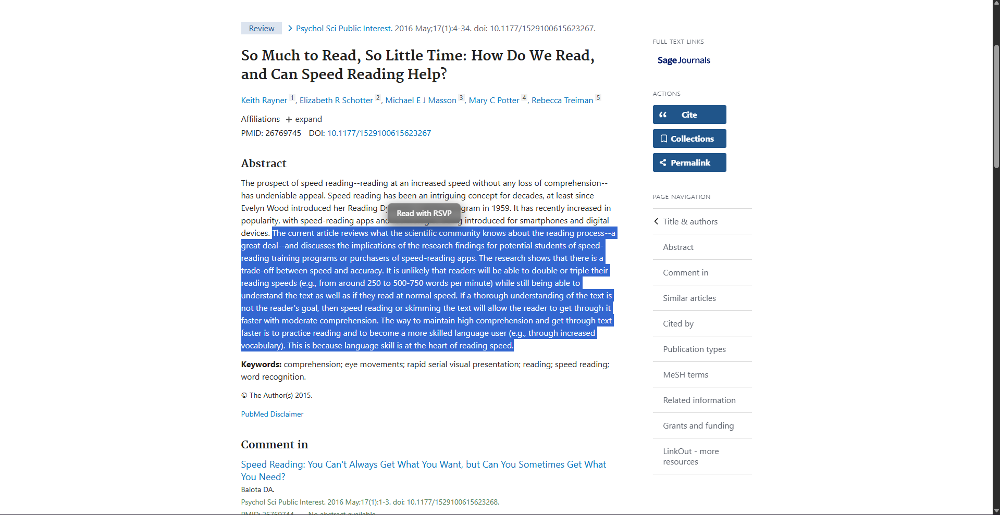
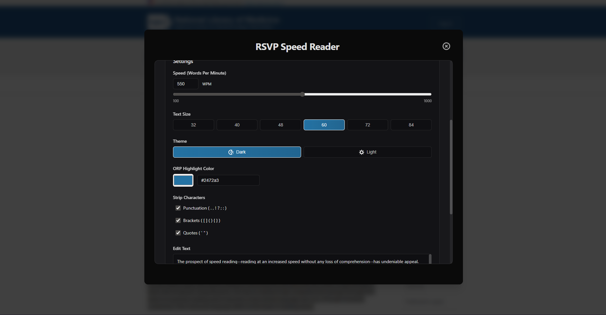
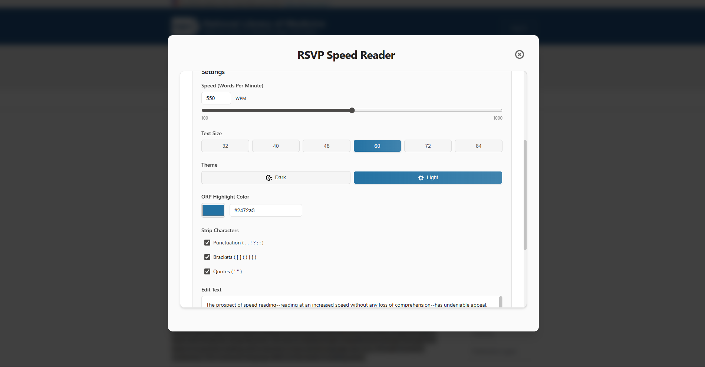
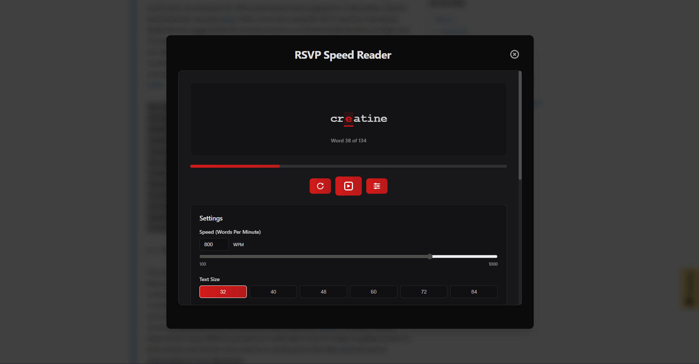
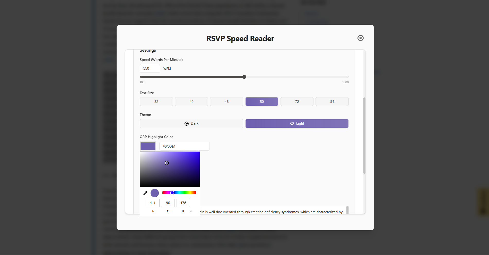

# RSVP Speed Reader

  

  <strong>Read faster with RSVP (Rapid Serial Visual Presentation)</strong>

---

## What is RSVP Speed Reader?

RSVP Speed Reader is a browser extension and webapp that helps you read text faster by displaying one word at a time at your preferred speed. With the extension simply highlight any text on a webpage, click the extension icon, and start speed reading!

## Available on Chrome
[RSVP Speed Reader Extension](https://chromewebstore.google.com/detail/rsvp-speed-reader/hphbbncjdkeddjlgkjfkmkmmcbehgmhn)

## Features
- Optimal Recognition Point for easier reading
- Keyboard Shortcuts
- Persistent Settings

## Customise:
- Reading Speed
- Text Size
- Light/Dark + Colour Theme

## Demo

Watch the video demo here: [RSVP Demo](https://www.youtube.com/watch?v=XuwoIL1O4pY)

Message brought to via RSVP: [RSVP Message](https://github.com/caspianlack/RSVP-Reader/assets/extension-example.mp4)

## Screenshots

### Quick Start - Highlight and Click
Select any text on a webpage and click the extension icon to start reading.

  

### Dark Mode
Easy on the eyes for nighttime reading.

  

### Light Mode
Clean and bright interface for daytime use.

  

### Adjustable Text Size
Choose the perfect text size for your comfort.

  

### Custom Colors
Personalize the ORP highlight color to your preference.

  

## License

This project is open source and available under the MIT License.

## Tips:

- Start with a comfortable speed (250-300 WPM) and gradually increase
- The highlighted letter (ORP) helps your eye anchor on each word
- Take breaks every 20-30 minutes to avoid eye strain
- Experiment with different text sizes to find what works best for you

## Acknowledgments

This project is utilises the groundbreaking research of Professor Mary C. Potter (MIT, Professor Emerita) who introduced the RSVP (Rapid Serial Visual Presentation) paradigm in cognitive science. Her pioneering work demonstrated that humans can understand the meaning of words and pictures in fractions of a second, and that sentences can be comprehended when presented as rapidly as 12 words per second.

Professor Potter's research on attention, perception, and very-short-term memory has helped us understand how our brains process information at remarkable speeds. Her work has shown that while we can understand meaning almost instantly, stabilizing that information in memory takes longer, which is a key insight that makes RSVP such an effective speed reading technique.

## Attribution:
<a href="https://www.flaticon.com/free-icons/" title="Flaticons">Icons from Flaticons</a>

  STILL ENJOY READING BUT USE RSVP FOR RESEARCH/ SKIMMING

